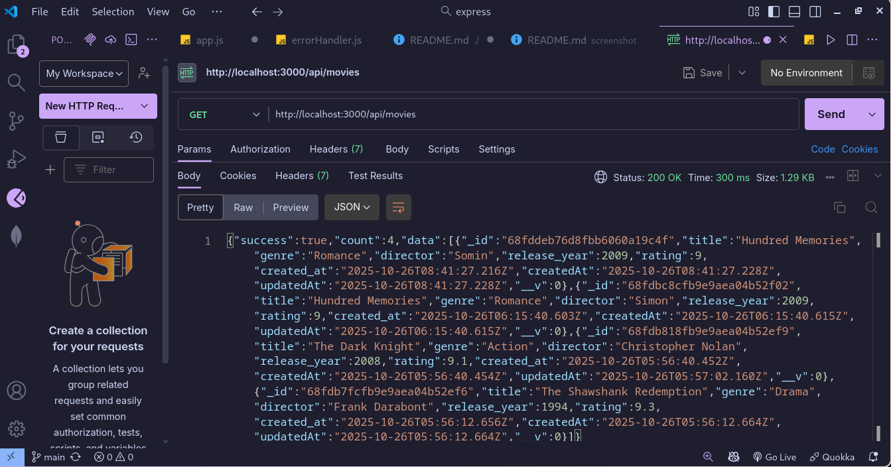
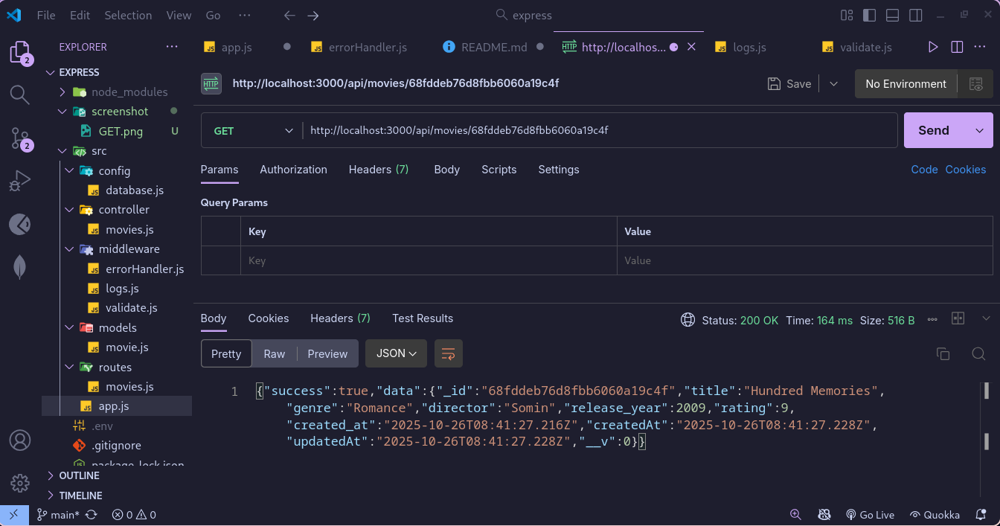
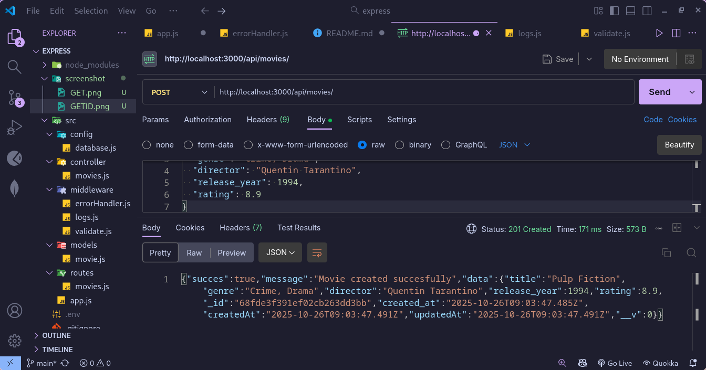
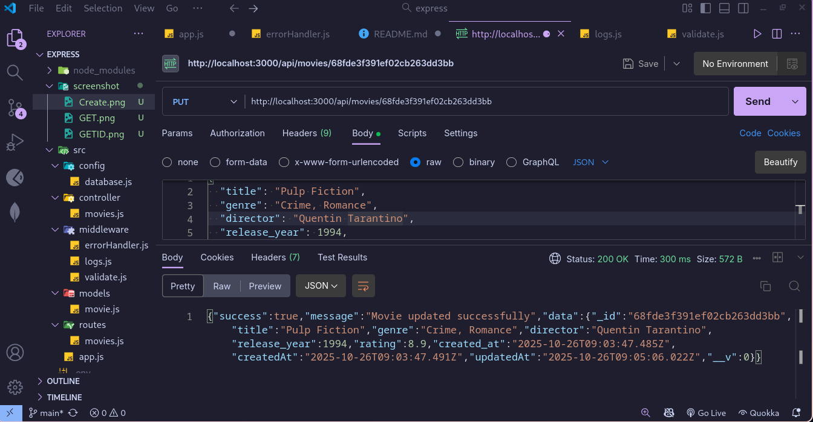
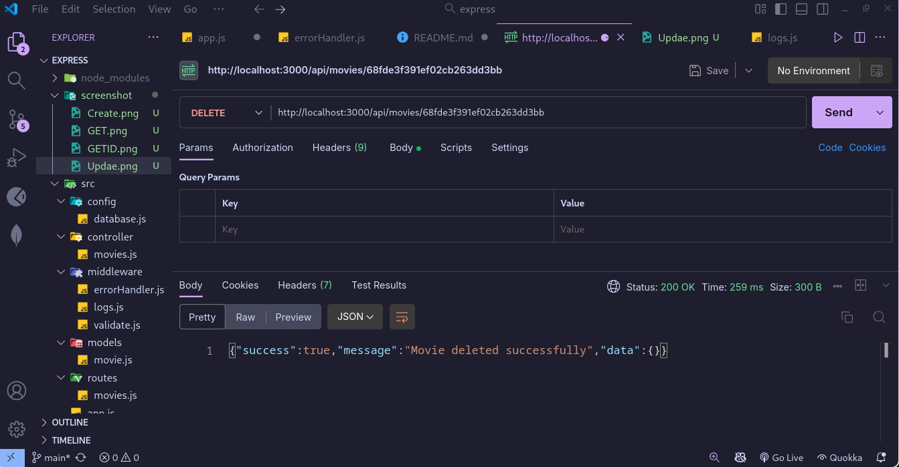

# Movies REST API

REST API untuk mengelola data film menggunakan Express.js dan MongoDB dengan struktur MVC (Model-View-Controller).

## Deskripsi

API ini menyediakan operasi CRUD (Create, Read, Update, Delete) untuk mengelola data film. Setiap film memiliki informasi seperti judul, genre, sutradara, tahun rilis, dan rating.

## Teknologi yang Digunakan

- **Express.js** - Framework web untuk Node.js
- **MongoDB** - Database NoSQL
- **Mongoose** - ODM untuk MongoDB
- **dotenv** - Mengelola environment variables
- **Node.js** - Runtime environment

## Struktur Folder

```
express/
├── src/
│   ├── config/
│   │   └── database.js       # Konfigurasi koneksi database
│   ├── controller/
│   │   └── movies.js         # Business logic untuk movies
│   ├── middleware/
│   │   ├── errorHandler.js   # Error handling middleware
│   │   ├── logs.js           # Logger middleware
│   │   └── validate.js       # Validation middleware
│   ├── models/
│   │   └── movie.js          # Schema dan model Movie
│   ├── routes/
│   │   └── movies.js         # Definisi routes untuk movies
│   └── app.js                # Entry point aplikasi
├── screenshot/               # Screenshot hasil uji coba
├── .env                      # Environment variables
├── .gitignore
├── package.json
└── README.md
```

## Cara Menjalankan

### 1. Install Dependencies

```bash
npm install
```

### 2. Setup Environment Variables

Pastikan file `.env` sudah ada dan berisi:

```env
MONGODB_URI=your_mongodb_connection_string
PORT=3000
NODE_ENV=development
```

### 3. Jalankan Aplikasi

```bash
# Production mode
npm start

# Development mode (dengan auto-reload)
npm run dev
```

Server akan berjalan di `http://localhost:3000`

## API Endpoints

### Base URL
```
http://localhost:3000/api/movies
```

### 1. Get All Movies
**GET** `/api/movies`

Mengambil semua data film.



### 2. Get Single Movie by ID
**GET** `/api/movies/:id`

Mengambil data film berdasarkan ID.

### 3. Create New Movie
**POST** `/api/movies`


Membuat data film baru.

### 4. Update Movie
**PUT** `/api/movies/:id`


Mengupdate data film berdasarkan ID.
  

### 5. Delete Movie
**DELETE** `/api/movies/:id`


Menghapus data film berdasarkan ID.


## Middleware

### 1. Logger Middleware
Mencatat setiap request yang masuk dengan format:
```
2024-01-15T10:30:00.000Z - GET /api/movies
```

### 2. Validation Middleware
Memvalidasi input data agar tidak kosong dan memenuhi kriteria:
- `title`: String, required
- `genre`: String, required
- `director`: String, required
- `release_year`: Number, required, min: 1888
- `rating`: Number, required, min: 0, max: 10


### 3. Error Handler Middleware
Menangani error dan menampilkan pesan error yang user-friendly.

**Error Response:**
```json
{
  "success": false,
  "error": "Movie not found"
}
```

## Database Schema

### Movie Model
```javascript
{
  title: String (required),
  genre: String (required),
  director: String (required),
  release_year: Number (required, min: 1888, max: 2029),
  rating: Number (required, min: 0, max: 10),
  created_at: Date (default: Date.now),
  createdAt: Date (auto),
  updatedAt: Date (auto)
}
```
